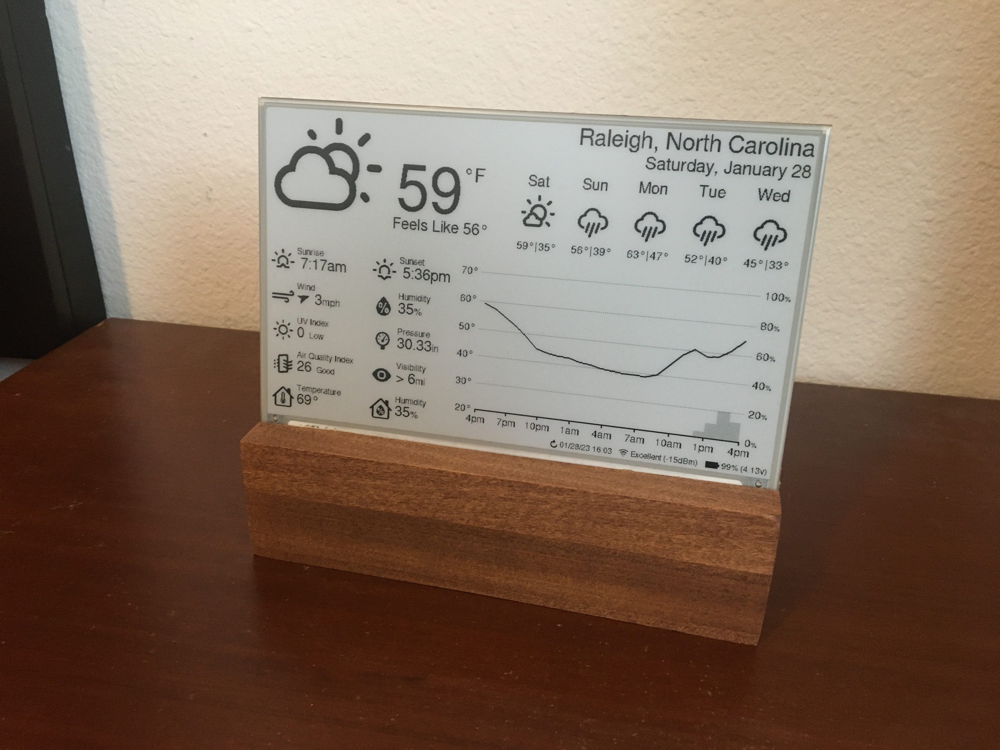
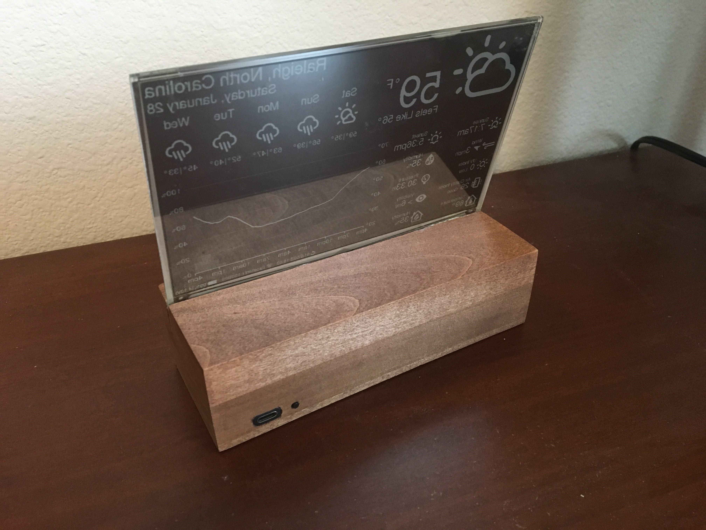
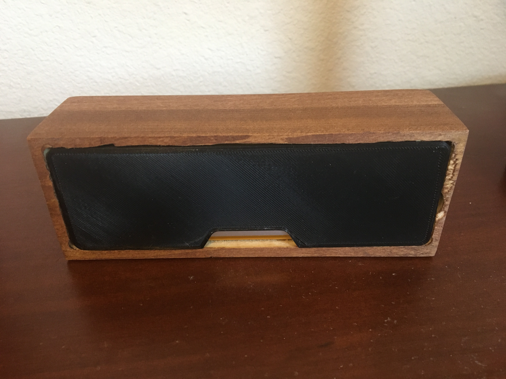
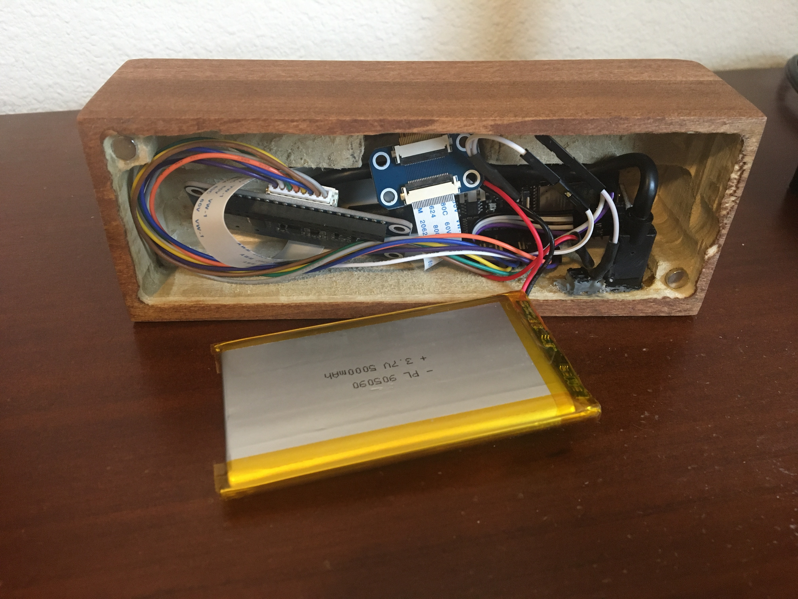
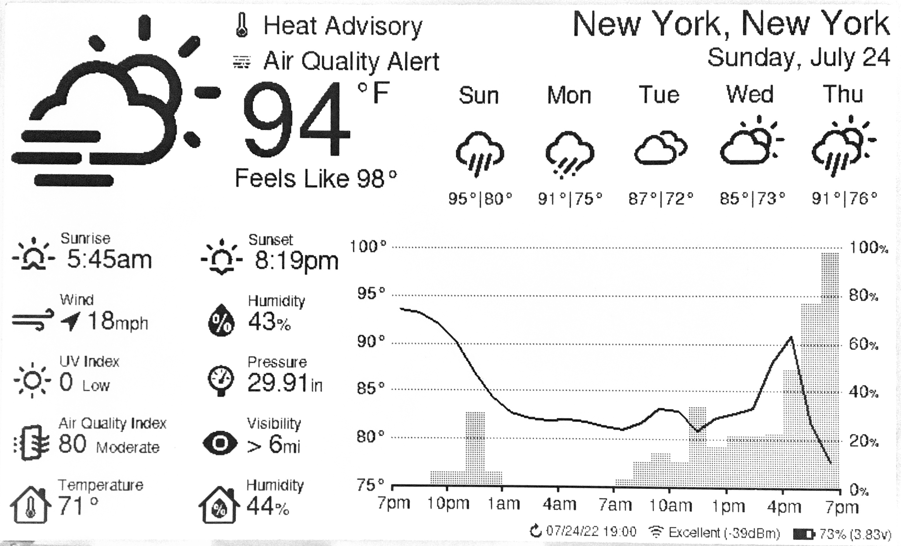
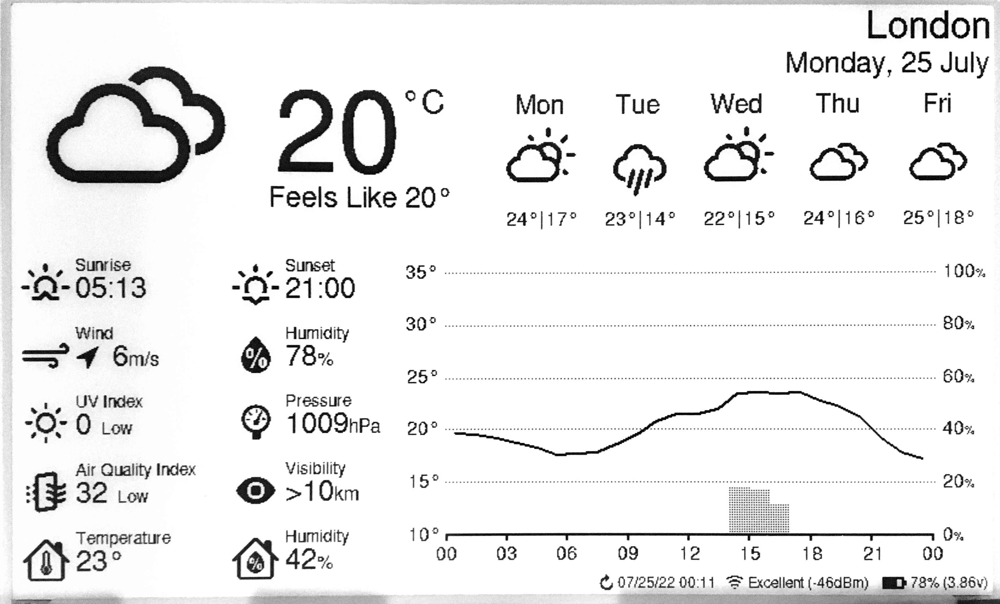
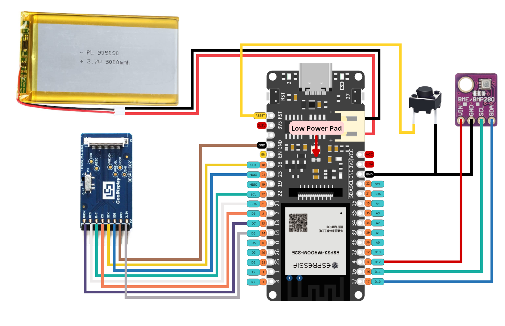
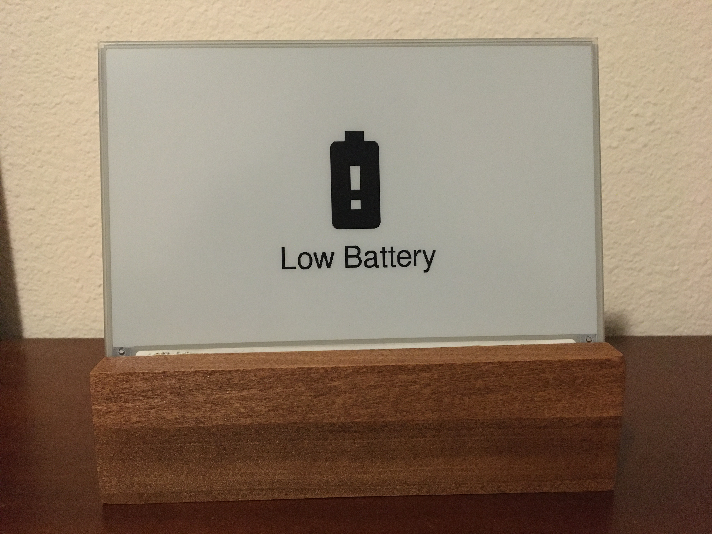
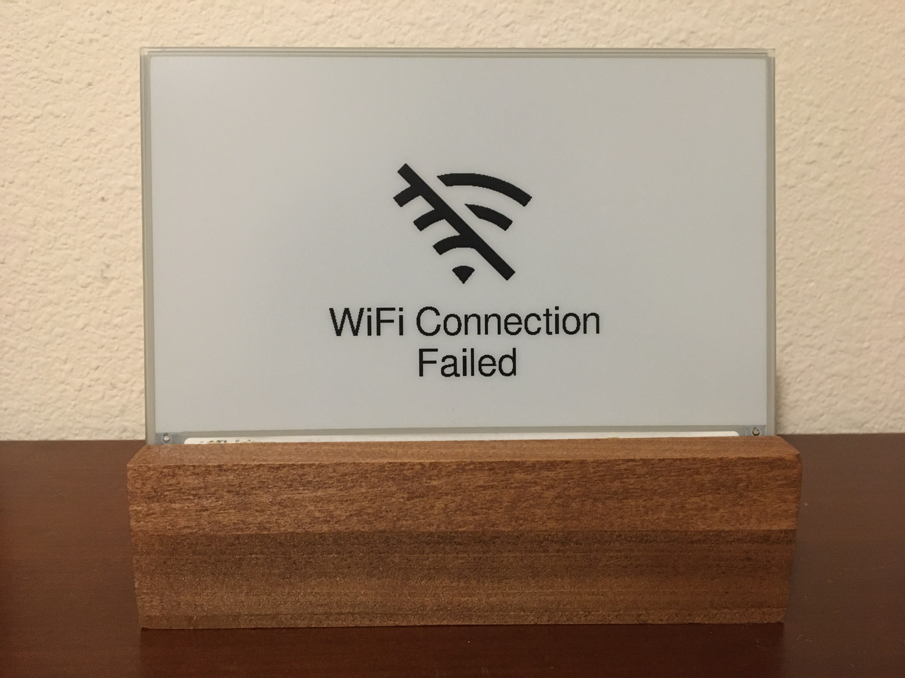
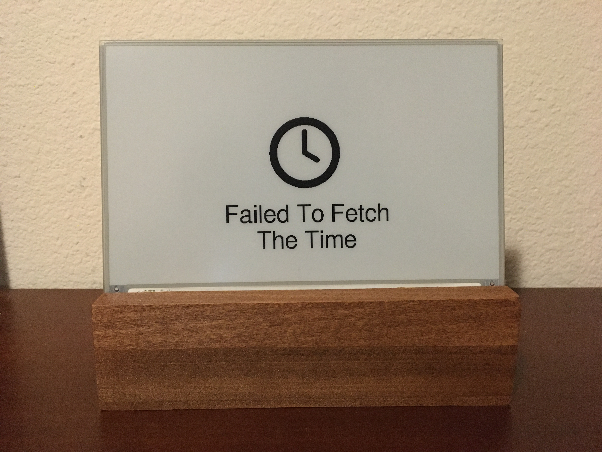

# ESP32 E-Paper Weather Display

A low-power weather display using a wifi-enabled ESP32 microcontroller and a 7.5" E-Paper display. Weather data is fetched from the OpenWeatherMap API, and an onboard sensor provides indoor temperature and humidity.

  
  
  
  
  

## Features

- Ultra-low power consumption: ~14μA in sleep, ~83mA during refresh (~15s).

- Long battery life: 6-12 months on a 5000mAh battery with 30-minute update frequency.

- Customizable display: Supports multiple languages, units, time/date formats, AQI scales, personalization options, and much more.

- Easy recharging: USB-C charging with battery monitoring.

The hourly outlook graph (bottom right) shows a line indicating temperature and shaded bars indicating probability of precipitation (or optionally volume of precipitation).

Here are two (slightly outdated) examples utilizing various configuration options:

  
  

## Contents

- [Required Components](#required-components)
  - [Panel Support](#panel-support)
  - [Enclosure Options](#enclosure-options)
  - [Solder-Free Component Selection](#solder-free-component-selection-optional)
- [Setup Guide](#setup-guide)
  - [Wiring](#wiring)
  - [Configuration, Compilation, and Upload](#configuration-compilation-and-upload)
  - [OpenWeatherMap API Key](#openweathermap-api-key)
- [Error Messages and Troubleshooting](#error-messages-and-troubleshooting)
  - [Low Battery](#low-battery)
  - [WiFi Connection](#wifi-connection)
  - [API Error](#api-error)
  - [Time Server Error](#time-server-error)
- [Licensing](#licensing)

## Required Components

  Some links below are affiliate links. Using them helps support the project at no extra cost to you—thanks for your support!

  | Component Type  | Component                                    | Notes                                                                                                    | Link                                                                         |
  |-----------------|----------------------------------------------|----------------------------------------------------------------------------------------------------------|------------------------------------------------------------------------------|
  | ESP32           | FireBeetle 2 ESP32-E                         | Features low-power design, USB-C, and battery management.                                                | Available [here](https://www.dfrobot.com/product-2195.html?tracking=PfSxQ8). |
  | E-Paper Display | See [Panel Support](#panel-support).         | See [Panel Support](#panel-support).                                                                     | See [Panel Support](#panel-support).                                         |
  | Adapter Board   | DESPI-C02                                    | Waveshare HATs (rev 2.2/2.3) are not recommended.                                                        | Available [here](https://www.aliexpress.us/item/3256804446769469.html).      |
  | Sensor          | BME280 (or DHT22)                            | Temperature, humidity, and pressure (DHT22 only measures temperature and humidity). 3.3V/5V compatible.  | Available from multiple vendors.                                             |
  | Battery         | 3.7V LiPo w/ JST-PH2.0 connector             | Any capacity (e.g., 5000mAh for 6+ months runtime)                                                       | Available from multiple vendors.                                             |
  | Enclosure       | See [Enclosure Options](#enclosure-options). | See [Enclosure Options](#enclosure-options).                                                             | See [Enclosure Options](#enclosure-options).                                 |

Other items needed:
- Wires ("Jumper Wires" if looking to minimize/avoid soldering).
- Solder Iron + Solder (unless following [Solder-Free Component Selection](#solder-free-component-selection-optional)).
- Linux, Windows, or MacOS computer (used to configure and install ESP32 firmware).
- Push Button (optional, if you want a reset button mounted on your enslosure, else you can use the on-board reset button).

### Panel Support

  Waveshare and Good Display make equivalent panels. Either variant will work.

  | Panel                                   | Resolution | Colors          | Notes                                                                                                                 |
  |-----------------------------------------|------------|-----------------|-----------------------------------------------------------------------------------------------------------------------|
  | Waveshare 7.5in e-paper (v2)            | 800x480px  | Black/White     | Available [here](https://www.waveshare.com/product/7.5inch-e-paper.htm). (recommended)                                |
  | Good Display 7.5in e-paper (GDEY075T7)  | 800x480px  | Black/White     | [Temporarily Unavailable](https://www.aliexpress.com/item/3256802683908868.html)? (wrong product listed?)             |
  | Waveshare 7.5in e-Paper (B)             | 800x480px  | Red/Black/White | Available [here](https://www.waveshare.com/product/7.5inch-e-paper-b.htm).                                            |
  | Good Display 7.5in e-paper (GDEY075Z08) | 800x480px  | Red/Black/White | Available [here](https://www.aliexpress.com/item/3256803540460035.html).                                              |
  | Waveshare 7.3in ACeP e-Paper (F)        | 800x480px  | 7-Color         | Available [here](https://www.waveshare.com/product/displays/e-paper/epaper-1/7.3inch-e-paper-f.htm).                  |
  | Good Display 7.3in e-paper (GDEY073D46) | 800x480px  | 7-Color         | Available [here](https://www.aliexpress.com/item/3256805485098421.html).                                              |
  | Waveshare 7.5in e-paper (v1)            | 640x384px  | Black/White     | Limited support. Some information not displayed, see [image](showcase/demo-waveshare75-version1.jpg).                 |
  | Good Display 7.5in e-paper (GDEW075T8)  | 640x384px  | Black/White     | Limited support. Some information not displayed, see [image](showcase/demo-waveshare75-version1.jpg).                 |

  This software has limited support for accent colors. E-paper panels with additional colors tend to have longer refresh times, which will reduce battery life.

### Enclosure Options

You'll want a nice way to show off your project. Here are a few popular choices.

- DIY Wooden
  - I made a small stand by hollowing out a piece of wood from the bottom. On the back, I used a short USB extension cable so that I can charge the battery without needing to remove the components from the stand. I also wired a small reset button to refresh the display manually. Additionally, I 3d printed a cover for the bottom, which is held on by magnets. The E-paper screen is very thin, so I used a thin piece of acrylic to support it.
  - Measurements:
    - depth = 63mm  
      height = 49mm  
      width = 170.2mm (= width of the screen)  
      screen angle = 80deg  
      screen is 15mm from the front
- 3D Printable
  - Here is a list of community designs.
  
    | Contributor                                                          | Link                                                                                                      |
    |----------------------------------------------------------------------|-----------------------------------------------------------------------------------------------------------|
    | [Kingfisher](https://www.printables.com/@Kingfisher_32821)           | [Printables](https://www.printables.com/model/1139047-weather-station-e-ink-frame)                        |
    | [Francois Allard](https://www.printables.com/@FrAllard_1585397)      | [Printables](https://www.printables.com/model/791477-weather-station-using-a-esp32)                       |
    | [3D Nate](https://www.printables.com/@3DNate_451157)                 | [Printables](https://www.printables.com/model/661183-e-ink-weather-station-frame)                         |
    | [Sven F.](https://github.com/Spanholz)                               | [Printables](https://www.printables.com/model/657756-case-for-esp32-weather-station)                      |
    | [Layers Studio](https://www.printables.com/@LayersStudio)            | [Printables](https://www.printables.com/model/655768-esp32-e-paper-weather-display-stand)                 |
    | [PJ Veltri](https://www.printables.com/@PJVeltri_1590999)            | [Printables](https://www.printables.com/model/692944-base-and-display-holder-for-esp-32-e-paper-weather)  |
    | [TheMeanCanEHdian](https://www.printables.com/@TheMeanCanEH_1207348) | [Printables](https://www.printables.com/model/841458-weather-display-enclosure)                           |
    | [MPHarms](https://www.thingiverse.com/mpharms/designs)               | [Thingiverse](https://www.thingiverse.com/thing:6666148)                                                  |
    | [Plaste-Metz](https://www.printables.com/@PlasteMetz_576567)         | [Printables](https://www.printables.com/model/1160924-weather-station-case)                               |
    | [kenwch92](https://github.com/kenwch92)                              | [Printables](https://www.printables.com/model/1505838-over-engineered-display-stand-for-esp32-e-paper-we) |
    | [Eckerput](https://github.com/Eckerput)                              | [Thingiverse](https://www.thingiverse.com/thing:7112836)                                                  |

  - If you want to share your own 3D printable designs, your contributions are highly encouraged and welcome!
- Picture Frame

### Solder-Free Component Selection (Optional)

This project can be completed without any soldering, if you choose your component selection carefully.
- Buy "Jumper Wires" to connect your components.
- Buy the [FireBeetle 2 ESP32-E w/ Headers](https://www.dfrobot.com/product-2231.html?tracking=PfSxQ8).
- Buy a BME280 (or DHT22) with headers soldered from the factory.
- Buy a reset switch that is compatible with jumper wires.

## Setup Guide

### Wiring

The battery can be charged by plugging the FireBeetle ESP32 into the wall via the USB-C connector while the battery is plugged into the ESP32's JST connector.

  > **Warning**
  > The polarity of JST-PH2.0 connectors is not standardized! You may need to swap the order of the wires in the connector.

NOTE: Waveshare now ships revision 2.3 of their e-paper HAT (no longer rev 2.2 ). Rev 2.3 has an additional `PWR` pin (not depicted in the wiring diagrams below); connect this pin to 3.3V.

IMPORTANT: The DESPI-C02 adapter has one physical switch that MUST be set correctly for the display to work.

- RESE: Set switch to position 0.47.

IMPORTANT: The Waveshare E-Paper Driver HAT has two physical switches that MUST be set correctly for the display to work.

- Display Config: Set switch to position B.

- Interface Config: Set switch to position 0.

Cut the low power pad for even longer battery life.

- From <https://wiki.dfrobot.com/FireBeetle_Board_ESP32_E_SKU_DFR0654>

  > Low Power Pad: This pad is specially designed for low power consumption. It is connected by default. You can cut off the thin wire in the middle with a knife to disconnect it. After disconnection, the static power consumption can be reduced by 500 μA. The power consumption can be reduced to 13 μA after controlling the maincontroller enter the sleep mode through the program. Note: when the pad is disconnected, you can only drive RGB LED light via the USB Power supply.

### Configuration, Compilation, and Upload

PlatformIO for VSCode is used for managing dependencies, code compilation, and uploading to ESP32.

1. Clone this repository or download and extract the .zip.

2. Install VSCode.

3. Follow these instructions to install the PlatformIO extension for VSCode: <https://platformio.org/install/ide?install=vscode>

4. Open the project in VSCode.

   a. File > Open Folder...

   b. Navigate to this project and select the folder called "platformio".

5. Configure Options.

   - Most configuration options are located in [config.cpp](platformio/src/config.cpp), with a few  in [config.h](platformio/include/config.h).

   - Important settings to configure in config.cpp:

     - WiFi credentials (ssid, password).

     - Open Weather Map API key (it's free, see next section for important notes about obtaining an API key).

     - Latitude and longitude.

     - Time and date formats.

     - Sleep duration.

   - Important settings to configure in config.h:

     - Units (Metric or Imperial).

   - Comments explain each option in detail.

6. Build and Upload Code.

   a. Connect ESP32 to your computer via USB.

   b. Click the upload arrow along the bottom of the VSCode window. (Should say "PlatformIO: Upload" if you hover over it.)

      - PlatformIO will automatically download the required third-party libraries, compile, and upload the code. :)

      - You will only see this if you have the PlatformIO extension installed.

      - If using a FireBeetle 2 ESP32-E and you receive the error `Wrong boot mode detected (0x13)! The chip needs to be in download mode.` unplug the power from the board, connect GPIO0 ([labeled 0/D5](https://wiki.dfrobot.com/FireBeetle_Board_ESP32_E_SKU_DFR0654#target_5)) to GND, and power it back up to put the board in download mode.

      - If you are getting other errors during the upload process, you may need to install drivers to allow you to upload code to the ESP32.

### OpenWeatherMap API Key

Sign up here to get an API key; it's free. <https://openweathermap.org/api>

This project will make calls to 2 different APIs ("One Call" and "Air Pollution").

- The One Call API 3.0 is only included in the "One Call by Call" subscription. This separate subscription includes 1,000 calls/day for free and allows you to pay only for the number of API calls made to this product.

Here's how to subscribe and avoid any credit card changes:
   - Go to <https://home.openweathermap.org/subscriptions/billing_info/onecall_30/base?key=base&service=onecall_30>
   - Follow the instructions to complete the subscription.
   - Go to <https://home.openweathermap.org/subscriptions> and set the "Calls per day (no more than)" to 1,000. This ensures you will never overrun the free calls.

## Error Messages and Troubleshooting

### Low Battery

This error screen appears once the battery voltage has fallen below LOW_BATTERY_VOLTAGE (default = 3.20v). The display will not refresh again until it detects battery voltage above LOW_BATTERY_VOLTAGE. When battery voltage is between LOW_BATTERY_VOLTAGE and VERY_LOW_BATTERY_VOLTAGE (default = 3.10v) the esp32 will deep-sleep for periods of LOW_BATTERY_SLEEP_INTERVAL (default = 30min) before checking battery voltage again. If the battery voltage falls between LOW_BATTERY_SLEEP_INTERVAL and CRIT_LOW_BATTERY_VOLTAGE (default = 3.00v), then the display will deep-sleep for periods VERY_LOW_BATTERY_SLEEP_INTERVAL (default = 120min). If battery voltage falls below CRIT_LOW_BATTERY_VOLTAGE, then the esp32 will enter hibernate mode and will require a manual push of the reset (RST) button to begin updating again.

 

### WiFi Connection

This error screen appears when the ESP32 fails to connect to WiFi. If the message reads "WiFi Connection Failed" this might indicate an incorrect password. If the message reads "SSID Not Available" this might indicate that you mistyped the SSID or that the esp32 is out of the range of the access point. The esp32 will retry once every SLEEP_DURATION (default = 30min).

 

### API Error

This error screen appears if an error (client or server) occurs when making an API request to OpenWeatherMap. The second line will give the error code followed by a descriptor phrase. Positive error codes correspond to HTTP response status codes, while error codes <= 0 indicate a client(esp32) error. The esp32 will retry once every SLEEP_DURATION (default = 30min).
  
In the example shown to the left, "401: Unauthorized" may be the result of an incorrect API key or that you are attempting to use the One Call v3 API without the proper account setup.

 

### Time Server Error

This error screen appears when the esp32 fails to fetch the time from NTP_SERVER_1/NTP_SERVER_2. This error sometimes occurs immediately after uploading to the esp32; in this case, just hit the reset button or wait for SLEEP_DURATION (default = 30min) and the esp32 to automatically retry. If the error persists, try selecting closer/lower latency time servers or increasing NTP_TIMEOUT.

 

## Licensing

esp32-weather-epd is licensed under the [GNU General Public License v3.0](LICENSE) with tools, fonts, and icons whose licenses are as follows:

| Name | License | Description |
|---------------------------------------------------------------------------------------------------------------|---------------------------------------------------------------------------------------|------------------------------------------------------------------------------------|
| [Adafruit-GFX-Library: fontconvert](https://github.com/adafruit/Adafruit-GFX-Library/tree/master/fontconvert) | [BSD License](fonts/fontconvert/license.txt) | CLI tool for preprocessing fonts to be used with the Adafruit_GFX Arduino library. |
| [pollutant-concentration-to-aqi](https://github.com/lmarzen/pollutant-concentration-to-aqi) | [GNU Lesser General Public License v2.1](platformio/lib/pollutant-concentration-to-aqi/LICENSE) | C library that converts pollutant concentrations to Air Quality Index(AQI). |
| [GNU FreeFont](https://www.gnu.org/software/freefont/) | [GNU General Public License v3.0](https://www.gnu.org/software/freefont/license.html) | Font Family |
| [Lato](https://fonts.google.com/specimen/Lato) | [SIL OFL v1.1](http://scripts.sil.org/OFL) | Font Family |
| [Montserrat](https://fonts.google.com/specimen/Montserrat) | [SIL OFL v1.1](http://scripts.sil.org/OFL) | Font Family |
| [Open Sans](https://fonts.google.com/specimen/Open+Sans) | [SIL OFL v1.1](http://scripts.sil.org/OFL) | Font Family |
| [Poppins](https://fonts.google.com/specimen/Poppins) | [SIL OFL v1.1](http://scripts.sil.org/OFL) | Font Family |
| [Quicksand](https://fonts.google.com/specimen/Quicksand) | [SIL OFL v1.1](http://scripts.sil.org/OFL) | Font Family |
| [Raleway](https://fonts.google.com/specimen/Raleway) | [SIL OFL v1.1](http://scripts.sil.org/OFL) | Font Family |
| [Roboto](https://fonts.google.com/specimen/Roboto) | [Apache License v2.0](https://www.apache.org/licenses/LICENSE-2.0) | Font Family |
| [Roboto Mono](https://fonts.google.com/specimen/Roboto+Mono) | [Apache License v2.0](https://www.apache.org/licenses/LICENSE-2.0) | Font Family |
| [Roboto Slab](https://fonts.google.com/specimen/Roboto+Slab) | [Apache License v2.0](https://www.apache.org/licenses/LICENSE-2.0) | Font Family |
| [Ubuntu font](https://design.ubuntu.com/font) | [Ubuntu Font Licence v1.0](https://ubuntu.com/legal/font-licence) | Font Family |
| [Weather Themed Icons](https://github.com/erikflowers/weather-icons) | [SIL OFL v1.1](http://scripts.sil.org/OFL) | (wi-**.svg) Weather icon family by Lukas Bischoff/Erik Flowers. |
| [Google Icons](https://fonts.google.com/icons) | [Apache License v2.0](https://www.apache.org/licenses/LICENSE-2.0) | (battery**.svg, visibility_icon.svg) Battery and visibility icons from Google Icons. |
| [Biological Hazard Symbol](https://svgsilh.com/image/37775.html) | [CC0 v1.0](https://en.wikipedia.org/wiki/Public_domain) | (biological_hazard_symbol.svg) Biohazard icon. |
| [House Icon](https://seekicon.com/free-icon/house_16) | [MIT License](http://opensource.org/licenses/mit-license.html) | (house.svg) House icon. |
| [Indoor Temerature/Humidity Icons](icons/svg) | [SIL OFL v1.1](http://scripts.sil.org/OFL) | (house_**.svg) Indoor temerature/humidity icons. |
| [Ionizing Radiation Symbol](https://svgsilh.com/image/309911.html) | [CC0 v1.0](https://creativecommons.org/publicdomain/zero/1.0/) | (ionizing_radiation_symbol.svg) Ionizing radiation icons. |
| [Phosphor Icons](https://github.com/phosphor-icons/homepage) | [MIT License](http://opensource.org/licenses/mit-license.html) | (wifi**.svg, warning_icon.svg, error_icon.svg) WiFi, Warning, and Error icons from Phosphor Icons. |
| [Wind Direction Icon](https://www.onlinewebfonts.com/icon/251550) | [CC BY v3.0](http://creativecommons.org/licenses/by/3.0) | (meteorological_wind_direction_**deg.svg) Meteorological wind direction icon from Online Web Fonts. |

