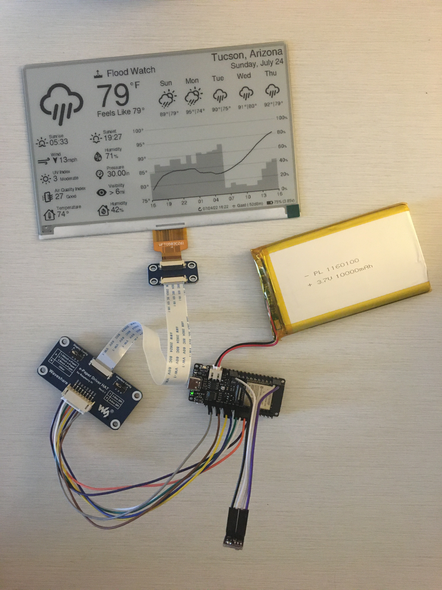

# ESP32 E-Paper Weather Display

This is a weather display powered by a wifi-enabled ESP32 microcontroller and a 7.5in E-Paper (aka E-ink) display. Current and forecasted weather data is obtained from the OpenWeatherMap API. A sensor provides the display with accurate indoor temperature and humidity.

The project draws ~14μA when sleeping and an estimated average of ~83mA during its 9-10s wake period. The display can be configured to update as frequently as desired, but with a refresh every 30 minutes the device can run for nearly a 6 monthes on a single 5000mAh battery. The project displays accurate battery life as a percentage on screen and can be recharged via USB-C and a wall-adapter or computer.

  
  
   
  
   

I made a small stand for mine by hollowing out a piece of wood from the bottom. On the back I used a short USB extension cable so that I could charge the battery without needing to remove the components from the stand. I also wired a small reset button, so that I can refresh the display manually. Additionally, I 3d printed a cover for the bottom which is held on by magnets. The E-paper screen is very thin so I decided to use a thin piece of acrylic to support it.

There are configuration options for everything from location, time/date formats, units, and language to air quality index scale and hourly outlook graph bounds.

The hourly outlook graph (bottom right) shows a line that indicates temperature and shaded bars that indicate probability of precipitation.

Here are two examples utilizing various different configuration options:

  
   

## Setup Guide

### Hardware

7.5inch (800×480) E-Ink Display w/ HAT for Raspberry Pi, SPI interface

- Advantages of E-Paper
  - Ultra Low Power Consumption - E-Paper (or E-Ink) displays are ideal for low-power applications that do not require frequent display refreshes. E-Paper displays only draw power when refreshing the display and do not have a backlight. Images will remain on the screen even when power is removed.

- Limitations of E-Paper: 
  - Colors - E-Paper has traditionally been limited to just black and white, but in recent years 3-color E-Paper screens have started showing up.

  - Refresh Times and Ghosting - E-Paper displays are highly susceptible to ghosting effects if refreshed too quickly. To avoid this, E-Paper displays often take a few seconds to refresh(4s for the unit used in this project) and will alternate between black and white a few times, which can be distracting.  

- https://www.waveshare.com/product/7.5inch-e-paper-hat.htm

FireBeetle 2 ESP32-E Microcontroller

- Why the ESP32?

  - Onboard WiFi.

  - 520kB of RAM and 4MB of FLASH. Enough to store lots of icons and fonts.

  - Low power consumption.

  - Small size, many small development boards available.

- Why the FireBeetle 2 ESP32-E

  - Drobot's FireBeetle ESP32 models are optimized for low-power consumption (https://diyi0t.com/reduce-the-esp32-power-consumption/). The Drobot's FireBeetle 2 ESP32-E variant offers USB-C, but older versions of the board with Mirco-USB would work just fine too.

  - Firebeelte ESP32 models include onboard charging circuitry for a 3.7v lithium-ion(LiPo) battery.

  - FireBeetle ESP32 models include onboard circuitry to monitor battery voltage of a battery connected to its JST-PH2.0 connector.

- https://www.dfrobot.com/product-2195.html

BME280 - Pressure, Temperature, and Humidity Sensor

- Provides accurate indoor temperature and humidity.

- Much faster than the DHT22, which requires a 2-second wait before reading temperature and humidity samples.

3.7V Lipo Battery w/ 2 Pin JST Connector 

- Size is up to you. I used a 10000mah battery so that the device can operate on a single charge for >1 year.

- The battery can be charged by plugging the FireBeetle ESP32 into the wall via the USB-C connector while the battery is plugged into the ESP32's JST connector.

  > **Warning**
  > The polarity of JST-PH2.0 connectors is not standardized! You may need to swap order of the wires in the connector.

### Wiring

Pin connections are defined in config.cpp. 

If you are using the FireBeetle 2 ESP32-E, you can use the connections I used or change them how you would like.

The E-Paper Driver Hat has two physical switches that must be set correctly for the display to work.

- Display Config: Set switch to position B.

- Interface Config: Set switch to position 0.

### Configuration, Compilation, and Upload

PlatformIO for VSCode is used for managing dependencies, code compilation, and upload to ESP32.

1. Clone this repository or download and extract the .zip.

2. Install VSCode.

3. Follow these instructions to install the PlatformIO extension for VSCode: https://platformio.org/install/ide?install=vscode

4. Open the project in VSCode.

   a. File > Open Folder...

   b. Navigate to this project and select the folder called "platformio".

5. Configure Options.

   - Most configuration options are located in config.cpp with the a few in config.h. Language options can also be found in lang_en_us.cpp.

   - Important settings to configure in config.cpp:

     - WiFi credentials (ssid, password).

     - Open Weather Map API key (it's free, see next section for important notes about obtaining an API key).

     - Latitude and longitude.

     - Time and date formats.

     - Sleep duration.

     - Pin connections for E-Paper (SPI), BME280 (I2C), and battery voltage (ADC).

   - Important settings to configure in config.h:

     - Units (Metric or Imperial).

   - Comments explain each option in detail.

6. Build and Upload Code.

   a. Connect ESP32 to your computer via USB.

   b. Click the upload arrow along the bottom of the VSCode window. (Should say "PlatformIO: Upload" if you hover over it.) 

      - PlatformIO will automatically download the required third-party libraries, compile, and upload the code. :)
     
      - You will not see this if you don't have the PlatformIO extension installed.

      - If you are getting errors during the upload process, you may need to install drivers to allow you to upload code to the ESP32.

### OpenWeatherMap API Key

Sign up here to get an API key, it's free. https://openweathermap.org/api

This project will make calls to 2 different APIs ("One Call" and "Air Pollution").

> **Note**
> OpenWeatherMap One Call 2.5 API has been deprecated for all new free users (accounts created after Summer 2022). Fortunately, you can make 1,000 calls/day to the One Call 3.0 API for free by following the steps below.

- If you have an account that was created before Summer 2022 you can simply use the One Call 2.5 API by changing `OWM_ONECALL_VERSION = "2.5";` in config.cpp.

- Otherwise, the One Call API 3.0 is included in the "One Call by Call" subscription only. This separate subscription includes 1,000 calls/day for free and allows you to pay only for the number of API calls made to this product.

Here’s how to subscribe and avoid any credit card changes:
   - Go to https://home.openweathermap.org/subscriptions/billing_info/onecall_30/base?key=base&service=onecall_30
   - Follow the instructions to complete the subscription.
   - Go to https://home.openweathermap.org/subscriptions and set the "Calls per day (no more than)" to 1,000. This ensures you will never overrun the free calls.
